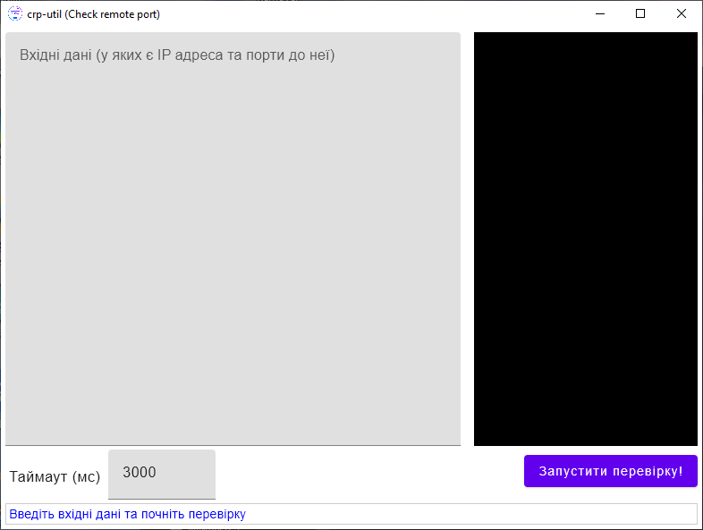

# check-remote-port
Desktop project written with Java to check is remote port available

## Main screen

## Screen with results

## Results actions

## Custom format

Download [link](https://github.com/liosha2007/crp-util/releases/)

----------------------------------------

Ping icons created by [Darius Dan - Flaticon](https://www.flaticon.com/free-icons/ping)